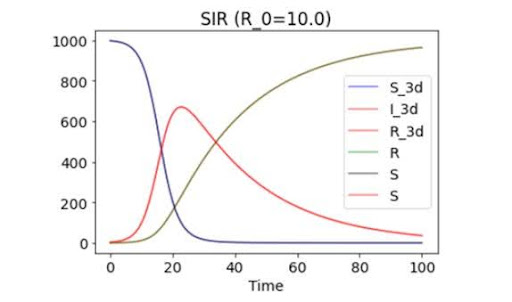
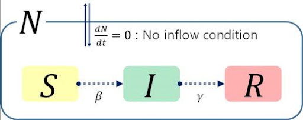
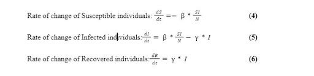

Welcome to my academic portfolio! This repository showcases selected projects from my undergraduate studies in mathematics and statistics. These projects demonstrate my skills in data analysis, mathematical modeling, and working with real-world datasets to explore timely topics such as public health and climate change.

---

## 🦠 Project 1: Modeling Infectious Disease Spread with SIR Models

**Course:** Math 542 — Mathematical Modeling  
**Tools:** Python, Mathematical Modeling, Least Squares  
**Topic:** COVID-19 SIR Model Simulation and Parameter Estimation  

### 🔍 Overview
This project explores the use of the SIR (Susceptible-Infectious-Recovered) model to understand infectious disease spread. Using real-world COVID-19 data from Tennessee, I simulated infection rates during key time intervals and estimated parameters using Python.

### 📌 Table of Contents
- SIR Model Overview
- Mathematical Formulation
- Dynamics and Assuption of the model
- Extensions of the SIR Model (e.g. SIRS model)
- Case Study : Tenessee Covid 19

### Three Components
- Susceptible (S): Individuals who are not infected but are at risk of contracting the disease.​
- Infectious (I): Individuals who are currently infected and can transmit the disease to others.​
- Recovered (R): Individuals who have recovered from the disease and are assumed to have gained immunity.​

Also notice the flow of the three components in the SIR model.
Susceptible -> Infected -> Recovered​

### Mathematical Formulation 
- β(beta): Transmission rate, representing the likelihood of disease transmission from an infected to a susceptible individual.​
- (γ)(gamma): Recovery rate, indicating the rate at which infected individuals recover and move to the recovered compartment.

### 🧪 Case Study Intervals 
- March 12–25, 2020
- November 2–15, 2020
- December 18–31, 2021

---

## 🌍 Project 2: Principal Component Analysis of Global CO₂ Emissions

**Course:** Stat 520 — Multivariate Statistics  
**Tools:** PCA, Correlation Matrix, Eigenvalue Analysis  
**Topic:** Identifying Major Global Contributors to CO₂ Emissions  

### 🔍 Overview
This project uses Principal Component Analysis (PCA) to analyze CO₂ emissions data from 1990 to 2021. The goal was to identify dominant trends and major contributors to global pollution using data from the EDGAR database.

### 📌 Key Concepts
- Dimensionality reduction via PCA
- Interpretation of eigenvalues and loading vectors
- Emissions trend comparison across major economies
- Environmental policy implications

### 📊 Findings
- The **first two principal components explain ~99%** of the variation.
- **Prin1** captured total emissions; **Prin2** revealed rising emissions in countries like China and India.
- China surpassed the U.S. in emissions by over 50% in recent years.
- The analysis reflects economic trends and raises questions about environmental responsibility.

---

## 🧮 Project 3: Numerical Methods — QR Factorization, SVD & Polynomial Approximations

**Course:** Numerical Matrix Analysis  
**Tools:** Python, MATLAB, Numerical Algorithms  
**Topic:** Linear Algebra Applications in Computational Modeling  

### 🔍 Overview
This project focused on exploring the stability and performance of key numerical linear algebra techniques, such as QR Factorization, Singular Value Decomposition (SVD), and Polynomial Approximations.

### 📌 Key Concepts
- QR Factorization for solving linear systems and least squares problems
- Singular Value Decomposition (SVD) for matrix stability and compression
- Polynomial approximations using Chebyshev and Taylor polynomials
- Stability analysis for different decomposition methods
- Application to real-world functions and modeling problems

### 📈 Impact
The project demonstrated how foundational numerical tools can be applied in solving high-dimensional problems efficiently and with controlled error. It reflects both theoretical understanding and applied computing skills essential in data science and engineering.

---

## 🧠 Skills Demonstrated

- Data analysis & modeling  
- Statistical estimation (least squares, PCA)  
- Numerical computation (SVD, QR, polynomial fitting)  
- Mathematical derivation & simulation  
- Python and MATLAB programming  
- Real-world data interpretation  
- Data visualization  
- Communication of technical findings  

---

## 📬 Contact

📧 alexis.papadakis@example.com  
🔗 [LinkedIn](#)  
📂 [View My Full Portfolio](#)
